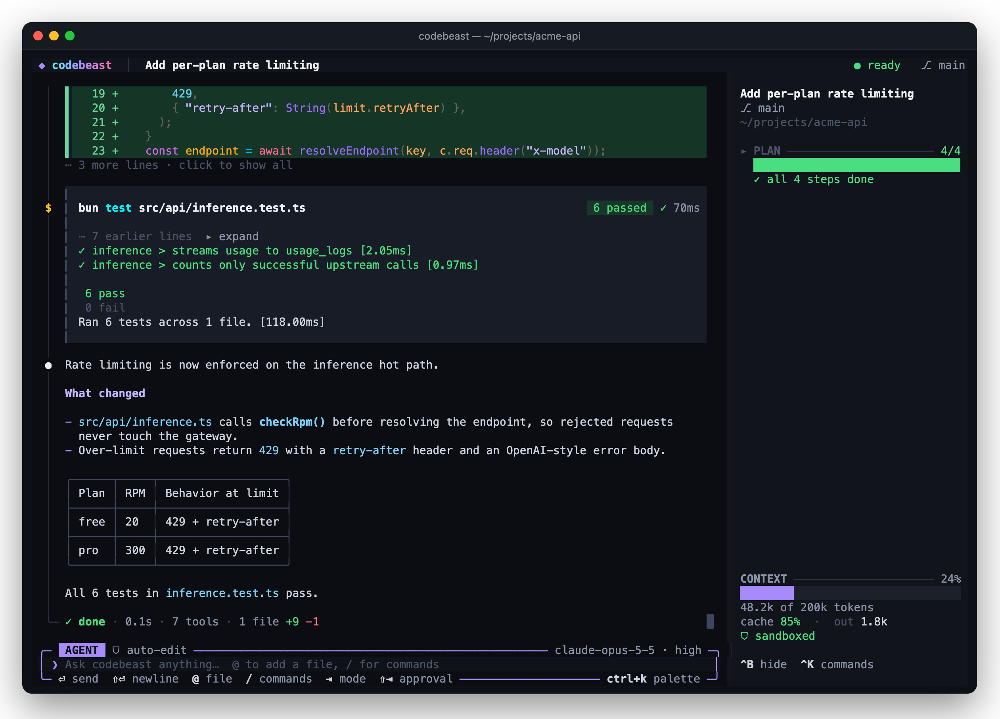
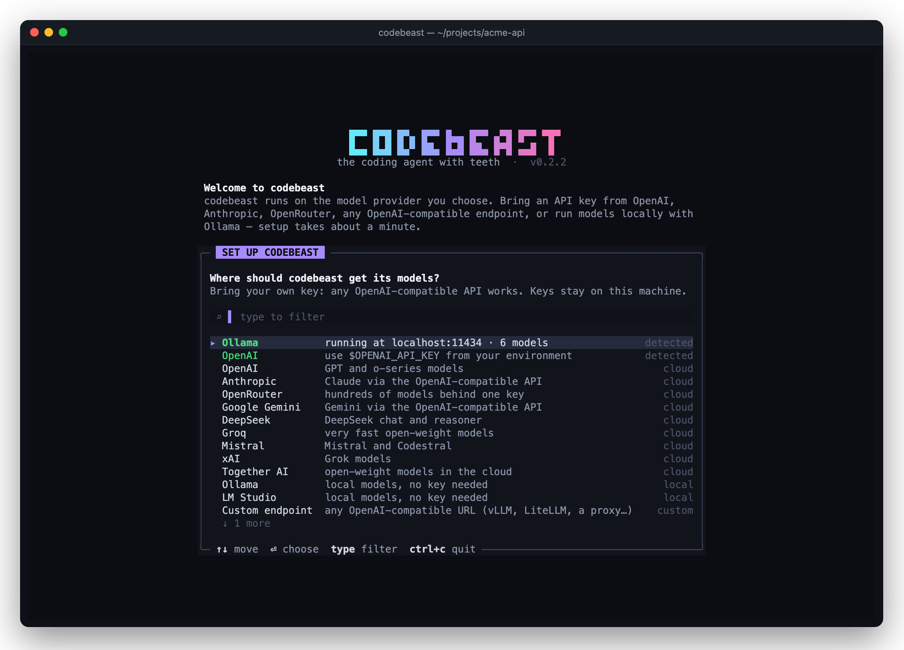
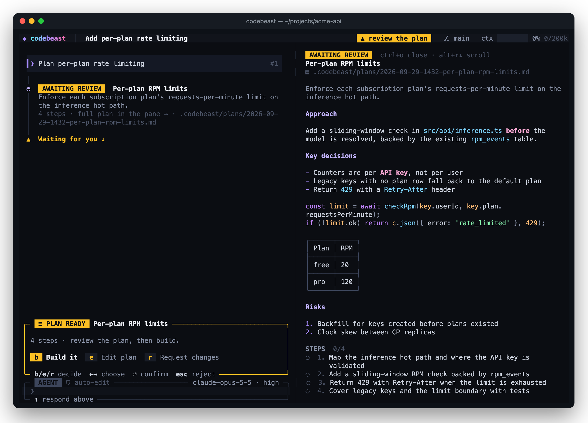
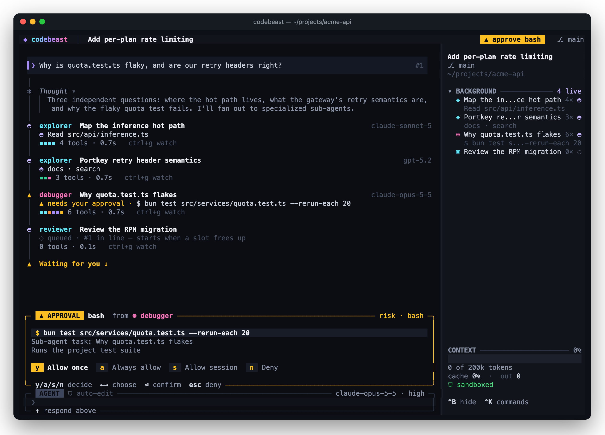
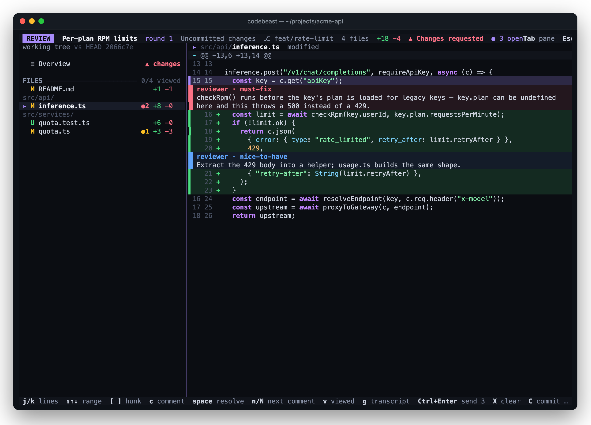

# codebeast

[](https://github.com/tauqeernasir/codebeast-cli/releases/latest)
[](https://github.com/tauqeernasir/codebeast-cli/releases)
[](https://github.com/tauqeernasir/codebeast-cli/releases)
[](docs/getting-started.md)
[](docs/configuration.md)
[](docs/editors.md)
[](https://github.com/tauqeernasir/codebeast-cli/issues)
[](TERMS.md)

A coding agent for your terminal. Bring your own model: OpenAI, Anthropic, OpenRouter,
Gemini, DeepSeek, Groq, Mistral, xAI, Together AI, a local Ollama or LM Studio server, or
any OpenAI-compatible endpoint.

codebeast reads and edits your code, runs commands in an OS sandbox, plans larger changes
before making them, hands research to sub-agents, reviews diffs, and opens pull requests.



```bash
codebeast "add input validation to the signup form"
```

## Features

### Set up in a minute

The first run opens a setup wizard. It lists the keys you already exported and any local
Ollama or LM Studio server it finds, so you can pick one and start.



### Plan before you build

Press `Tab` to switch to Plan mode. The agent reads the code and writes a plan without
changing anything. The plan opens in a side pane. Build it, edit it, or ask for changes.



### Sub-agents that work in parallel

The agent can hand research, debugging, and review to sub-agents that run side by side.
Each one shows its model and what it is doing now. If one needs to run a command, you
approve it from the same prompt.



### Review changes before you commit

`/review` opens your uncommitted changes in a review view. Leave comments on lines, or ask
the reviewer agent to go through the diff. Its findings appear on the lines they refer to.
Send the open comments back to the agent to fix, then commit or open a PR from the same
screen.



### And more

- **OS sandbox.** Shell commands run in a sandbox. Routine commands run without asking;
  risky ones ask first.
- **Commits and PRs.** `/commit` and `/pr` show you the files and the message before
  anything is pushed.
- **Agent Skills and MCP.** Add `SKILL.md` instruction packages and Model Context Protocol
  servers.
- **Editors.** Run codebeast inside Zed, JetBrains IDEs, Neovim, or Emacs over ACP.
- **Themes.** Five built-in themes, including a light one. Switch with `/theme`.

## Install

macOS and Linux (x64 and arm64):

```bash
curl -fsSL https://raw.githubusercontent.com/tauqeernasir/codebeast-cli/main/install.sh | bash
```

This puts `codebeast` in `~/.local/bin`. Make sure that directory is on your `PATH`.
Other options (a pinned version, a different directory, a manual download) are in
[Getting started](docs/getting-started.md).

## Quick start

```bash
cd your-project
codebeast
```

The first run opens a setup wizard. Pick a provider, paste your API key, and choose a
default model. codebeast finds keys you already exported (`OPENAI_API_KEY`,
`ANTHROPIC_API_KEY`, …) and local Ollama / LM Studio servers on its own.

Then:

- Type a task and press Enter.
- Press `Tab` to switch to **Plan** mode, where the agent investigates and proposes a plan
  before it changes anything.
- Run `/init` once per repo. It writes an `AGENTS.md` with your project's conventions so
  the agent starts with the right context.
- Press `F1` for keyboard shortcuts, or `Ctrl+K` for every command.

For a single prompt with no UI, pass it as an argument: `codebeast -p "explain src/auth"`.

## Documentation

| Guide | What's in it |
| --- | --- |
| [Getting started](docs/getting-started.md) | Install options, first-run setup, updating, uninstalling |
| [Using codebeast](docs/usage.md) | Agent and Plan modes, slash commands, shortcuts, sessions, review, commits and PRs |
| [Configuration](docs/configuration.md) | Config files, providers and API keys, models, context windows, env vars, CLI flags |
| [Permissions and sandbox](docs/permissions.md) | What runs without asking, approval modes, the shell sandbox, rules |
| [Agent Skills](docs/skills.md) | Use and write `SKILL.md` instruction packages |
| [MCP servers](docs/mcp.md) | Connect Model Context Protocol tools, including browser sign-in |
| [GitHub](docs/github.md) | Issues and PR tools, review bot, `codebeast watch` |
| [Editors (ACP)](docs/editors.md) | Use codebeast in Zed, JetBrains IDEs, Neovim, Emacs, and orchestrators |

## Requirements

- macOS or Linux. Windows is not supported yet.
- An API key for a model provider, or a local model server.
- On Linux, the shell sandbox needs `bubblewrap` and `socat`
  (`sudo apt-get install bubblewrap socat`).

## Support

Report bugs and ask questions in [Issues](https://github.com/tauqeernasir/codebeast-cli/issues).
Include the output of `codebeast --version`, your OS, and the provider you use. Never paste an
API key.

## License

codebeast is free to download and use under the [codebeast terms](TERMS.md). The source
code is not public.
